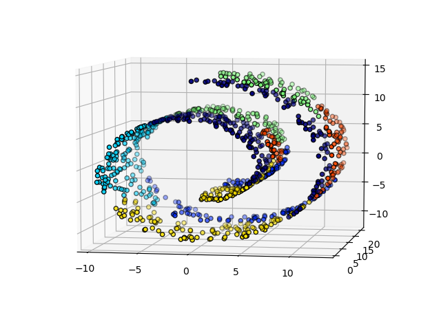
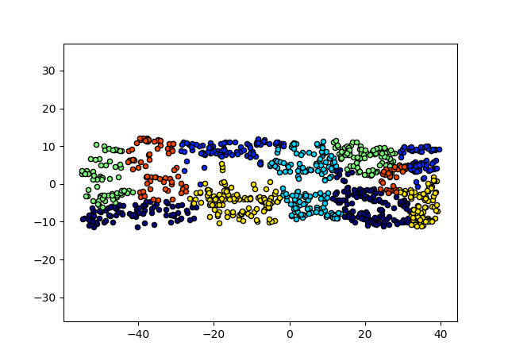

# 等度量映射(Isomap)
## 一、介绍
等度量映射(Isometric Mapping, Isomap)属于流形学习(manifold learning)的范畴，流形学习假设处理的数据处在一个高维空间的低维流形上。设Y⊂R<sup>d</sup>是一个低维流形，
映射f:Y-->R<sup>D</sup>是一个光滑嵌入(embedding)，且D>d。数据集{yi}是随机生成的，且经过嵌入映射f映射维观测空间的数据{xi=f(yi)}。基于流形学习的降维任务就是要在给定高维空间观测样本{xi}的情况下，
发现隐含的嵌入(embedding)映射f，并重构低维流形下的数据{yi}。

流形最重要的性质(也是定义)就是流形局部拓扑同胚(homeomorphism)于一个欧式空间。比如三维空间中的二维曲面，在二维曲面任意一点的邻域内，都可以认为和R<sup>2</sup>空间在拓扑意义上“像的不能再像”(存在一个连续的双射)。

等度量映射的出发点在于使用流形的内蕴距离测地距(geodesic)代替嵌入空间的度量。接着构造关于测地距的距离矩阵，然后使用[MDS](../docs/MDS.md)进行降维。

## 二、原理
### 2.1 算法流程
```
输入：样本集、近邻参数k、降维维度d'
1. 确定xi的k近邻点，k近邻之间的距离为欧式距离，与其它点的距离为∞，构造有
向带权图邻接矩阵W，权重为距离。
2. 调用最短路径算法计算任意两个样本之间距离dist(xi, xj)，构造距离矩阵D。
3. 将D作为MDS的输入进行降维。

```
可以看到，算法流程中最重要的一步就是如何计算数据关于测地距的距离矩阵。利用流形在局部上与欧式空间拓扑同胚的性质，对每个点关于其嵌入空间的欧式距离找出近邻点，
然后就能建立一个近邻连接图，于是计算两点之间测地线距离的问题，就转变为计算**近邻连接图上两点间最短路径的问题**。


### 2.2 最短路径问题
最短路径问题是图论中的一个经典问题，即求一张有向带权图任意两点之间的最短路径(路径权值和最小)，对Isomap来说，求出最短路径相当于求出了两个点之间的测地距离。
迪杰斯特拉(Dijkstra)算法和弗洛伊德(Floyd)算法是求解最短路径问题的经典算法。

#### 2.2.1 Dijkstra算法
Dijkstra算法是一种求单源最短路径的算法，即给定一个点A(源)，算法输出A到图中各个顶点最短路径，算法复杂度O(N<sup>2</sup>)。Dijkstra算法基于贪婪算法思想(但并非求近似解，输出为最优解)，算法流程如下：
```
输入：图邻接矩阵，源节点i，求i到图中所有节点的最短路径
1. 构建一个musk向量M，记录节点是否访问（访问为T，否则为F），初始化均为F
2. 构建一个dist向量D，记录i到该节点最短距离，初始化为inf。
3. 考虑节点i，令M[i] = T，考虑该节点所有未标记出度，计算更新距离向量D。
4. 从所有标签为F的节点中，找出距离最小的节点记为j(贪婪算法的体现)，令M[j]=T。
5. 令新节点j为i重复3,4
```
如果除了输出节点i到图上任意节点之间最短距离之外，还要输出最短路径，则需要引入父亲向量P，记录当前节点的父节点。

#### 2.2.2 Floyd算法
Floyd算法是一种基于动态规划思想的算法，算法输出图中任意两个点之间的最短路径，时间复杂度O(N<sup>3</sup>)，与将每个图中每个点作为Dijkstra算法的输入相比，Floyd算法更简便。

```
输入：有向带权图的邻接矩阵W，求最短距离矩阵D
过程：
令D = W
1. for v = 1:N
2.     # v为任意两个节点路径之间的中间节点
3.     for i = 1:N
4.         for j=1:N
5.              if D[i, j] > D[i, v] + D[v, j]:
6.                  D[i, j] = D[i, v] + D[v, j]            

```
Floyd算法被形象地称为“三层循环算法”，若除了输出两点之间最短距离之外还要输出最短路径，则需要引入路径矩阵P，记录任意两个节点之间的最佳中间节点即可。

## 2.3 构建有向带权图
通过数据点构建有向带权图时，可以使用knn或者ε-neighboured建图，这两种方法都能用Kd-tree进行加速。

ε-neighboured建图确立了一个密度下界，只有数据密度超过这一下界才能形成一条边，当ε取的较大，则距离很远的点会误认为近邻，出现”短路“问题；若范围很小，则会导致图变得不连通，出现”断路“问题，短路和断路都会给最短路径计算造成困扰。
另外，ε-neighboured建图构建的是无向图，邻接矩阵对称。

knn建图即求节点i的k个最近邻节点，然后生成k个从i出发的有向边，这种方法对数据不同的采样密度有较高的鲁棒性，图的邻接矩阵是非对称的。

## 三、效果
### 1. 原始数据(瑞士卷 1500点)



### 2. Isomap



可以看瑞士卷作为三维空间中的二维流形，在用Isomap降维算法后被”展开“了，这是和PCA、KPCA、普通度量下MDS等降维算法非常不一样的地方。

## 四、总结
证明高维数据是一个高维空间中的低维流形最有说服力的证据就是GAN，生成器就是一个嵌入函数(embedding function)，把低维随机噪声(低维流形)嵌入到高维空间中，
通过调整噪声的参数可以看到图像连续的变化。

在Isomap降维效果影响因素:
1. 如果数据是分类任务，则数据一般不会是一个高维空间的嵌入流形，而是分离的团簇，Isomap降维效果较差。不过也可以用建图之后互不相连的连接成分(connected component)进行降维。
2. Isomap非常依赖于建图的质量，而建图质量非常依赖于数据的**采样密度**，在瑞士卷的例子中，在三维空间中采样了1500个点，Isomap才有较好的效果。如果对图像几万维的数据，
需要非常多的样本才能覆盖住数据所处的流形。这是高维情形下面临的重大障碍，因此流形学习方法在实践中的降维往往没有预期的好。

流形学习的想法对机器学习的其它分支也产生了重要影响，比如流形假设、流形正则化等。个人认为，**流形**和**概率**是赋予数据最自然的性质，目前也有学者将两者结合进行研究，比如最优传输理论。


## 五、参考资料
1. 周志华. 机器学习 : = Machine learning[M]. 清华大学出版社, 2016.(第十章)
2. [sklearn Swiss Roll](https://scikit-learn.org/stable/modules/generated/sklearn.datasets.make_swiss_roll.html)
3. [sklearn Isomap](https://scikit-learn.org/stable/modules/generated/sklearn.manifold.Isomap.html)


