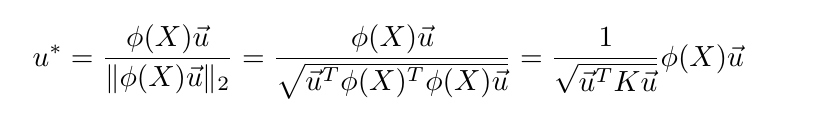
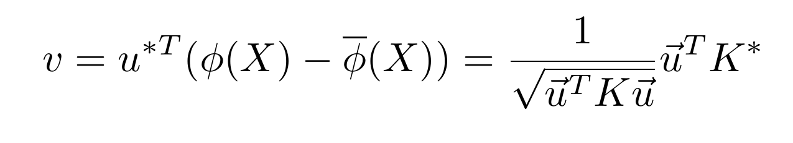

# KPCA(kernel-based PCA)
## 一、介绍
KPCA是PCA加上核技术，解决某些线性不可分的数据在用PCA投影之后不同类的数据会发生交叠，导致后面分类器精度降低的问题。

## 二、原理
核技术就是将当前空间线性不可分的数据X通过映射φ映射到高维空间(又称为特征空间 feature space)进而线性可分。而KPCA实质上就是在特征空间(feature space)中对数据使用PCA。更具体一点，
[PCA](PCA.md)是要计算原空间中数据的协方差矩阵1/N * XX<sup>T</sup>，然后进行特征值分解；而KPCA就是要计算特征空间中数据的协方差矩阵C=1/N * φ(X)φ(X)<sup>T</sup>并进行特征值分解(假设矩阵X和φ(X)每行的均值均为0)。

**注意**：这里的映射φ是**隐式**的(implicit)，不必知道它的具体形式。在核技巧中，对称正定的核函数K(x, y)是已知的，φ是通过核函数K诱导出来的，即K(x, y) = <φ(x), φ(y)>。定义核矩阵(kernel matrix),
K = φ(X)<sup>T</sup>φ(X) = [<φ(xi), φ(xj)>]<sub> i, j= 1, 2, 3, ..., m</sub>。

考虑一般矩阵不为0的情况，则特征空间协方差矩阵C为：


可以看到关于核矩阵线性运算得到的矩阵K* = K - 1 / N * K * **1**<sub>N×N</sub>与特征空间协方差矩阵C相似，进而有相同的特征值λ。由下式可得，相同特征值下，
K*归一化特征向量为u，则协方差矩阵C特征向量为φ(X)u。


向量φ(X)u归一化为：



算出协方差矩阵的归一化特征向量之后，特征空间的中心化数据需要在较大的特征值上投影，投影坐标v为：



至此发现KPCA完全没有使用φ函数，而是直接用核函数K(x, y)和由其定义的核矩阵K完成了在**特征空间上的最大方差投影**计算，具体算法步骤总结如下：

```
目标：将数据先映射到特征空间，再降维到k维
1. 定义核函数，算出核矩阵K，和中心化核矩阵K*。
2. 算出中心化核矩阵K*的特征向量和特征值，取较大的k个特征值对应的k个单位特征向量u1, u2, ..., un。
3. 算出特征空间投影坐标 vi (i=1,2,...,k)。
```
