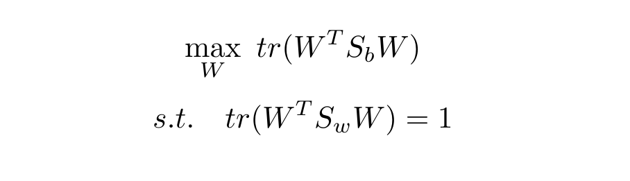

# 线性判别分析
## 一、介绍
线性判别分析(Linear Discriminant Analysis, LDA)是一种监督式线性降维方法，也称为Fisher判别。LDA的思想非常朴素，给定训练集，将训练集投影到某个超平面上，
使得同类样例的投影点尽可能接近，异类样例点尽量远离。对新样本点进行分类时，将其投影到该超平面上，再根据投影点的位置确定新样本的类别。因此，LDA本身还是一种分类算法。

## 二、原理
### 2.1 二分类
给定训练集D = {(xi, yi)} i=1, 2, ..., N，yi∈{0, 1}。Xi, μi, Σi(i∈{0, 1})分别表示属于i标签的训练集集合，对应均值和协方差矩阵。若将数据投影到超平面w上，则
中心投影坐标为wTμ0和wTμ1，协方差矩阵为wTΣ0w和wTΣ1w。

为使投影到超平面上后类内紧密，类间远离，定义类内散度矩阵("within-class scatter matrix"):

定义类间散度矩阵：

称下式为关于Sb和Sw的广义瑞利熵：

而要实现类内紧密，类间原理的效果，可以将问题转化为如下优化函数：

由lagrange乘子法可得W的闭式解是Sw-1Sb的d'个最大非0广义特征值对应特征向量组成的矩阵。
将W视为一个投影矩阵，则相当于将样本投影(降维)到d’维空间。**注意**：d'≤ N - 1，因为Sw-1Sb最多有N-1个非零广义特征值。

### 2.2 多分类
LDA多分类问题和二分类问题的优化形式和求解方式相同，唯一的区别在于类内散度矩阵Sw和类间散度矩阵Sb的定义。

类内散度矩阵(within-class scatter matrix)是二分类中Sw的一个自然推广：

而类间散度矩阵(between-class scatter matrix)则需要用全局散度矩阵诱导出来(也是二分类LDA的推广)：

其中μ代表训练集中所有样本的均值。

### 2.3 概率理解LDA
LDA不仅是一个监督式线性降维算法，本身还是一个**分类器**。LDA假设每一类的观测样本都来自一个均值不同，方差相同的正态分布，在满足这些假设的情况下，LDA分类器是贝叶斯分类器，
达到最优分类。

在LDA中我们假设P(x|c)服从多元正态分布，密度函数维：

而每一类的协方差矩阵都相同即Σc = Σ，令先验分布为P(c)，则P(c|x)由Bayes公式可得：

对P(C)P(X|C)取对数并丢掉常数项，可得线性判别函数：

而对应LDA分类(也是Bayes分类器)为h*(x) = argmaxc δc(x)，下面考虑LDA分类器的决策边界：

上述参数Σ、μi、P(C)可以用训练集样本进行点估计。可以看到LDA降维就是将数据朝着分类边界法向量上投影，降维后决策有两种方式：一是直接考虑投影的中心点，
最近中心点就是其类别，这种方式没有考虑P(C)的先验；另一种是考虑P(C)先验，用线性决策函数来计算对应类别。

## 三、效果
### 1. moon数据

### 2. regression数据

## 四、总结
1. 与[PCA](PCA.md)降维结果对比可以发现，PCA没有考虑数据标签的信息，让数据投影后方差最大；而LDA则考虑了训练集数据的标签信息，让数据朝着类内紧密、类间分离的方向投影。
2. LDA从贝叶斯决策理论的角度来看，当两类数据满足高斯分布且协方差矩阵相等时，LDA可达到最优分类。
3. 类间散度矩阵的迹也叫类间方差，OTSU图像分割算法就是最大化类间方差算法。

**补充**：[QDA](QDA.md)

## 五、参考资料
[1]周志华. 机器学习 : = Machine learning[M]. 清华大学出版社, 2016.(第十章)

[2][https://blog.csdn.net/VictoriaW/article/details/78275394](https://blog.csdn.net/VictoriaW/article/details/78275394)
