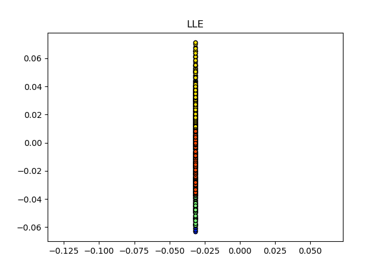
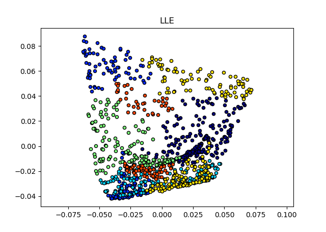

# 局部线性嵌入
## 一、介绍
局部线性嵌入(Locally Linear Embedding)和Isomap一样是非线性的无监督降维方法，属于流形学习的范畴，流形学习的介绍见[Isomap](ISOMAP.md)。Isomap算法假定嵌入映射是一个保测地距离映射。
而LLE则认为嵌入映射让邻域之间的线性关系得到保持。假定高维空间样本点xi能通过它的邻域样本，xj，xk，xl的坐标线性组合而重构出来：

xi = w<sub>ij</sub>xj + w<sub>ik</sub>xk + w<sub>il</sub>xl

LLE希望上式的重构关系在降维后得到保持。

综上，LLE利用了微分流形局部和某个(低维)欧式空间拓扑同胚的性质，某个点的可以利用局域点线性表出，并假设嵌入(embedding)映射是一个保局域线性结构的映射。

## 二、原理

### 2.1 算法流程


```
目标：将数据由d维降至d'维
1. 寻找每个样本的k个近邻点。
2. 由每个样本的近邻点计算局部重建权值矩阵W。
3. 由局部重建权值矩阵W计算样本点的降维(嵌入)坐标。
```
### 2.2 计算权值重建矩阵
Notation：对数据点xi∈R<sup>d</sup>，其k个邻域点为xij，wij为对应的重建权重(也是待求参数)，Qi为数据点xi邻域点指标集。


将上式写成矩阵形式并用lagrange乘子法求解，有闭式解：


计算出每个数据点对应权值后可以用N×N矩阵W表示，满足(W)<sub>ji</sub> = wij，不在k近邻位置元素的权重记为0

## 2.3 计算低维坐标

Notation: Zi为降维后的坐标(待优化参数)，wij在2.2已求，属于已知变量。


同2.2，将上述优化写成矩阵的形式后，得：


对M做特征值分解，Z就是M最小d'个特征值对应特征向量矩阵的转置。**注意**：0天然是M最小的特征值，对应特征向量为[1, 1, ..., 1]，所以如果将0包括在内，则会导致降维实际上少一个自由度，
因此常常取**非0最小的d'个特征值**对应特征向量作为降维坐标Z。

## 三、效果
### 1. 原始数据 swiss roll(1000 points)


### 2. K=30，包括0特征值



### 3. K=30，不包括0特征值



## 四、总结
LLE相对ISOMAP来说，运算速度要快非常多，但从降维的效果可以看出，LLE降维数据有一大部分是重叠的，降维效果没有Isomap好。这是因为LLE只是保持数据局域的线性结构，
而Isomap保持了全局的测地距离。

## 五、参考资料
[1]周志华. 机器学习 : = Machine learning[M]. 清华大学出版社, 2016.(第十章)

[2][https://blog.csdn.net/scott198510/article/details/76099630](https://blog.csdn.net/scott198510/article/details/76099630)

