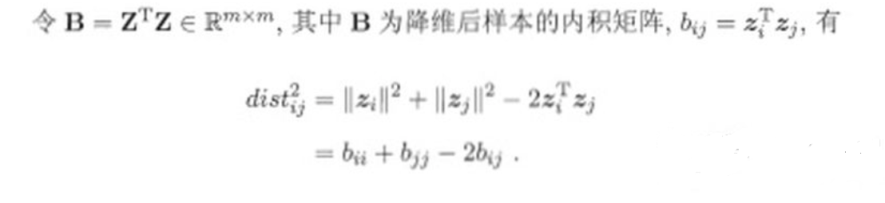
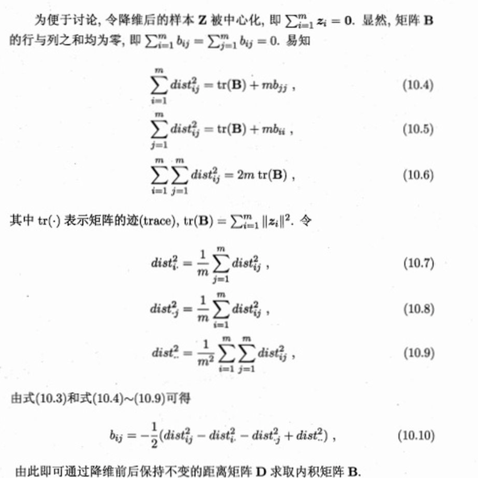

# MDS(多维缩放算法)
## 一、介绍
MDS(Multiple Dimensional Scaling)是一种无监督的线性降维算法。

## 二、原理
所谓线性降维就是降维变换是一个线性变换，即x<sup>new</sup>=Px，其中P是一个矩阵。对像空间赋予不同的性质或做出不同的假设，即得到不同的P。而MDS算法对像空间的假设是，
原像空间中样本之间的距离应尽量等于像空间中的**欧式距离**。MDS本质上是将数据从一个任意的度量空间映射到一个低维的欧式空间，且映射尽量保距离。

假设m个样本在原像空间的距离矩阵为D∈R<sup>m×m</sup>，dij代表样本点xi和xj之间的距离。我们的目标是获得样本在k维空间的表示，Z∈R<sup>k×m</sup>，且k维空间任意
两个样本的欧式距离等于原像空间的距离，即||zi-zj||<sub>2</sub>=dij。由于欧式距离可以由欧式空间的内积诱导，这里将D距离矩阵转换成降维后样本的内积矩阵：




求出内积矩阵B之后(B是对称(半)正定矩阵)，对B做特征值分解B=VAV<sup>T</sup>，而矩阵Z = VA<sup>0.5</sup>的行向量就可以当做m维欧式空间的坐标。接着再将m维欧式空间降维到k维欧式空间，
具体做法是取A最大的k个特征值对应的特征向量，Z<sub>k</sub>=V<sub>k</sub>A<sub>k</sub>的行向量就是样本在k维空间的坐标。之所以这样做，是因为对欧式空间保距离和保内积是等价的，
而取最大的K个特征值可以在矩阵Frobenius范数、二范数、Nuclear范数诱导的度量下最小化内积矩阵的变化。

综上，可以认为MDS是将任意度量空间的数据点先等距映射到m维欧式空间，再从m维欧式空间在内积矩阵变动最小的情况下降维到k维欧式空间。具体算法流程如下：

```
1. 求原像空间m个数据点的距离矩阵D
2. 求等距变换下m维欧式空间的内积矩阵B
3. 对B矩阵做特征值分解，取最大的k个特征值对应特征向量，Zk行向量作为降维后k维欧式空间数据点的坐标
```


