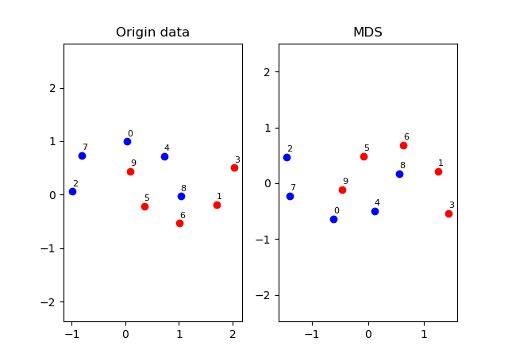

# MDS(多维缩放算法)
## 一、介绍
MDS(Multiple Dimensional Scaling)是一种无监督的线性降维算法。

## 二、原理
线性降维就是降维变换是一个线性变换，x<sup>new</sup>=Px，其中P是一个矩阵。对降维后数据做出不同的假设，即得到不同的P。比如[PCA](PCA.md)对降维后数据做最大可分性假设，
而MDS算法对降维数据的假设是，原像空间中数据之间的距离应尽量等于像空间中的**欧式距离**。MDS本质上是将数据从一个任意的度量空间映射到一个低维的欧式空间，且映射尽量保距离。

假设m个样本在原像空间的距离矩阵为D∈R<sup>m×m</sup>，dij代表样本点xi和xj之间的距离。我们的目标是获得样本在k维空间的表示，Z∈R<sup>k×m</sup>，且k维空间任意
两个样本的欧式距离等于原像空间的距离，即||zi-zj||<sub>2</sub>=dij。由于欧式距离可以由欧式空间的内积诱导，这里将D距离矩阵转换成降维后样本的内积矩阵B = Z<sup>T</sup>Z(又称为Gram矩阵)：


求出内积矩阵B之后(B是对称(半)正定矩阵)，对B做特征值分解B=VAV<sup>T</sup>，而矩阵Z<sup>T</sup> = VA<sup>0.5</sup>的行向量就可以当做m维欧式空间的坐标。接着再将m维欧式空间降维到k维欧式空间，
具体做法是取A最大的k个特征值对应的特征向量，Z<sub>k</sub><sup>T</sup>=V<sub>k</sub>A<sub>k</sub>的行向量就是样本在k维空间的坐标。之所以这样做，是因为对欧式空间保距离和保内积是等价的，
而取最大的K个特征值可以在矩阵Frobenius范数、二范数、Nuclear范数诱导的度量下最小化内积矩阵的变化。

综上，可以认为MDS是将任意度量空间的数据点先等距映射到m维欧式空间，再从m维欧式空间在内积矩阵变动最小的情况下降维到k维欧式空间。具体算法流程如下：

```
1. 求原像空间m个数据点的距离矩阵D
2. 求等距变换下m维欧式空间的内积矩阵B
3. 对B矩阵做特征值分解，取最大的k个特征值对应特征向量，Zk行向量作为降维后k维欧式空间数据点的坐标
```

## 三、效果

### 1. 降维维度为2，原像空间采取欧式距离



可以看到MDS在输入维度和输出维度相同的情况下，对原数据做了一个刚体变换。

### 2. 降维维度为1，原像空间采取欧式距离


大部分数据点间的相对位置大小得到保持，但部分点也有失真，比如降维后点2和点7之间的距离就过小。

## 四、总结
MSD降维基于的假设是降维欧式空间样本点之间的欧式距离应和原度量空间中样本之间的距离尽量相同。为此，先构造距离矩阵D，然后用D诱导出一个对称(半)正定的内积矩阵B，再对B进行特征值分解，
将VA<sup>0.5</sup>行向量作为坐标，并用B较大的特征值对应特征向量来降维(V<sub>k</sub>A<sub>k</sub><sup>0.5</sup>的行向量作为新坐标)。

将对称半正定矩阵进行特征值分解，VA<sup>0.5</sup>作为数据新的表示(坐标)的思想在核方法中也有体现，还有比如在主题模型TSD中，
采用svd分解后作为文本，单词数据新的表示进行降维。

参考资料[2]提出用SGD优化算法求解该问题，优化目标为min||D‘-D||，这种方法在样本较多时容易陷入局部最优解，但它直接比较距离矩阵，而不是像MDS那样间接地比较内积矩阵B。
个人认为SGD优化方法更通用也容易扩展到非线性保距降维，但是MDS算法更深刻，将线性保距离降维问题转换成一个简单的线性代数问题，更elegant。


## 五、参考资料
[1]周志华. 机器学习 : = Machine learning[M]. 清华大学出版社, 2016.(第十章)

[2][https://blog.csdn.net/zhangweiguo_717/article/details/69663452](https://blog.csdn.net/zhangweiguo_717/article/details/69663452)

