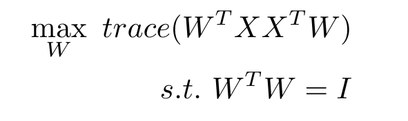
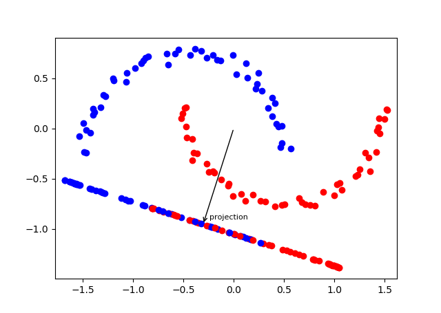
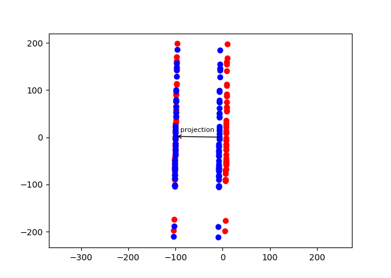

# 主成分分析(PCA)
## 一、介绍
主成分分析(Principal Component Analysis, PCA)是一种最常用的降维技术，它属于**无监督的线性降维算法**，常用于高维数据的预处理。

## 二、原理
假设每次采样得到x∈Rd维数据，共n个样本，构成d行n列矩阵X∈Rd×n。将d维向量降为k维，PCA的做法是选择k个归一化正交基，张成一个K维超平面W，
使得数据投影到这个k维超平面之后，样本点新坐标WTx能尽可能的分开(方差最大化)。表述成优化问题即：

通过拉格朗日乘子法，可以得到最优解W*为协方差矩阵XXT前k个最大的特征值对应特征向量作为列向量组成的矩阵，2.1和2.2给出两种等价的PCA算法。

### 2.1 协方差矩阵特征值分解

设有n条d维数据，构成d行n列矩阵X
1. 将X的每一行(每一个特征)减去该行均值(中心化)
2. 求出协方差矩阵S = 1/mXXT
3. 对协方差矩阵进行特征值分解S = QAQT
4. 取前k个最大特征值对应的特征向量按列构成矩阵Qk
5. P = QkTX即为降维到k维后的数据

可以做一个简单的理论分析，降维后的数据的协方差矩阵为PPT = QkTX XTQk = Ak，
即新数据的协方差矩阵是一个k维对角阵，且对角元素为对角阵A的最大k个特征值。

### 2.2 奇异值分解

设有n条d维数据，构成d行n列矩阵X
1. 将X的每一行(每一个特征)减去该行均值(中心化)
2. 对X进行奇异值分解，X = U∑VT，取X的最大k个奇异值对应的左奇异向量构成矩阵Uk
3. P = UkTX即为降维到k维后的数据

同样的，这种操作也可以证明降维后的数据协方差矩阵为对角阵，且对角元素为最大k个奇异值的平方。2.1和2.2的做法是完全等价的，相比而言奇异值分解更简洁，
使用右奇异矩阵可以对数据的列进行降维，使用左奇异值矩阵可以对数据的行进行降维。

## 三 效果

从PCA的降维结果可以赋予PCA一个几何解释，即朝着方差最大的k个正交方向上“投影”。但要注意的是，PCA是一种无监督的数据降维方法，在降维的过程中没有考虑数据的标签。
虽然方差较大的k个正交方向在大多数时候都能保存数据的信息，丢弃的是方差较小的噪声，但也不排除对于某些数据(见下图)，最能分辨数据标签的特征的方差较小，而在投影过程中，这些特征被抹去了，
进而导致数据后续分类效果较差。所以，在使用PCA的时候，需要比较降维前后学习器的性能，若性能有所提高，则认为降维起到了作用。

## 四、总结

