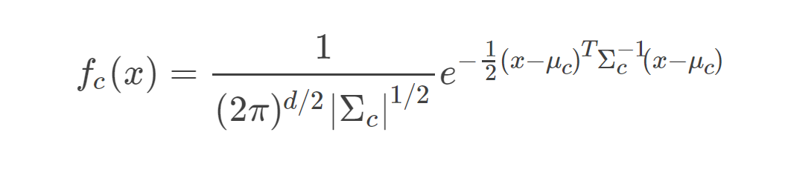

# 二次判别分析
## 一、介绍
二次判别分析(Quadratic Discriminant Analysis)是经典的分类器，与[LDA](LDA.md)不同的地方在于，二次判别分析是二次决策曲面，而线性判别分析是线性决策面,
QDA的缺点是它不能用作降维技术。

## 二、原理

在QDA中我们假设P(x|c)服从多元正态分布，密度函数为：

与LDA不同的是，QDA不再假设各个类别之间协方差矩阵相等。令先验分布为P(c)，则P(c|x)由Bayes公式可得：

对P(C)P(X|C)取对数并丢掉常数项，可得二次判别函数：

和LDA一样，利用该判别函数做判别即得到QDA二次分类边界，这里不再赘述。

## 三、总结

### 3.1 LDA和QDA的对比
LDA和QDA模型的选择是一个偏差-方差均衡的问题，LDA模型更简单，因此具有更低的方差；而如果LDA假设K类具有相同的方差是一个非常糟糕的假设，那么LDA会产生非常大的偏差。
一般来说，如果训练样本较少，使用模型更简单的LDA更好。而如果训练集很大，则应选择QDA，因为这时大规模训练集会帮助降低模型的方差。

### 3.2 LDA、逻辑回归、QDA、KNN对比
按照分类边界来分的话，逻辑回归和LDA都是线性决策边界，两种方法的区别在于，逻辑回归假设数据X|C服从指数分布，使用极大似然估计；而LDA假设X|C服从正态分布，用替换法 (频率替换法和矩估计法) 进行参数估计。
逻辑回归和LDA会产生相似的分类边界，但不一定相同。当数据满足LDA假设的高斯分布时，LDA比逻辑回归效果更好；当数据满足逻辑回归假设的指数分布时，逻辑回归效果更好。

QDA和KNN分类器产生的都是非线性的决策边界，KNN是一种非参数方法，对决策边界形状没有做出任何的假设，只对数据X所处的度量空间做了假设，因此当决策边界是高度非线性的时候，用KNN会优于LDA和逻辑回
归；而另一方面，KNN 模型没有给出哪些预测变量是重要的，可解释性较差。QDA可以看成KNN和逻辑回归、LDA之间的一种折中的方法，QDA的决策边界是二次的，所以它比线性方法应用范围更广，虽然不如KNN决策边界光滑，但
QDA在固定训练数据量的问题上一般比KNN有更好的效果。

## 四、参考资料
[1] James G ,  D  Witten,  Hastie T , et al. An Introduction to Statistical Learning: With Applications in R[M].  2013.
